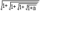
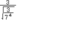

# PlusMinus Mini

PlusMinus Mini is a numerical computation system. Its ultimate goal is to be written in pure Python without any libraries installed via pip.
A physical scientific calculator model may be possible in the near future.

## Features
PlusMinus Mini is equipped with the features required for a physical system- a computation engine, an expression tokenizer and parser, and a textbook display expression renderer. 
There are many implemented computation functions including methods involving calculus and regression:
### comp.py
- Precision only limited by Python's Fraction object
- Complex Numbers
- Standard Functions (Logarithmic functions, Trigonometric Functions, Absolute Value, Factorial, Choose Function)
- Lambert W Function
- Error Function
### methods.py
- Solvers for Quadratic, Cubic, and Quartic functions
- Numerical Root Solving
- Linear Regression
- Derivatives at $x=n$
- Definite Integrals
- Summation and Product Evaluation

### tokenizer.py
PlusMinus Mini has a tokenizer and parser system that will convert expressions from string form to a list of tokens or a parsed expression (warning: uses `eval()`). 
The string format is supposed to be easy for the user and computer to understand.

### render.py
It also has a renderer that can render expressions of the same string format to an array of points similar to how expressions would be written by hand. 

      

You can see more of this in [the renderer torture test folder.](/tortureTest)

### tests.py

There is a file containing various tests for `comp.py`, the parser in `tokenizer.py`, `render.py`, and `system.py`.

PlusMinus Mini is also equipped with the file `system.py`, which is a calculation system that may be useful for operating the calculator's functions. Inputs can call a function and, 
from the current state of the data, the screen will be modified accordingly.
A "demo" can be seen in [the system torture test folder.](/systemTortureTest)

## What should I take?
- Want the whole system? Sure, go for it!
- You just need the main computational stuff? Try taking `comp.py`, `xmath.py`, and (optional) `methods.py`.
- Want to be able to write and parse expressions in the math string format? Take `mathcode.py` for writing and `tokenizer.py`, `delimiters.py`, `comp.py`, `methods.py`,and `xmath.py` for interpreting.
- To start rendering, you'll need `render.py`, `renderformats.py`, `tokenizer.py`, `delimiters.py`.

You may have to remove some parts of the scripts for a specific part to work; for example, `delimiters.py` is dependent on `comp.py` and `methods.py` but only for the functions used in `tokenizer.py`.